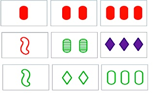

# SET GAME SOLVER

Set is a card game, for each crad there 4 parameters:
1. shape type - oval/wave/diamond
2. number of shapes - 1/2/3                                         
3. shape color - Green/Red/Purple
4. shpae shade - full,empty,stripes


 


### The conditions for Set
```bash
"set" are 3 cards that each of the parameters mentioned above should be the 
same in all the cards or different in all the cards in the trio
```
 


## algorithm 
```bash
The main challenge was identifying the cards and identifying the parameters on each card.
I could do many parts with the deep learning and machine learning, but the goal of the project was to learn image processing in general and openCV in particular
```

### image processing
```bash
The main image processing was done with 3 simple functions
1.find contours - Identifies shapes by distinguishing them from a given filter
2. gaussian blur - Blurs the image and reduces noise 
3. Threshold - Shows the differences between 2 images by coloring different pixels in white (255) and identical pixels in black (0)
4. canny - A filter that emphasizes contours
```


### set finding
```bash
For finding the set I used brute force search because the number of options is not large - 12 choose 3 = 220.
```
